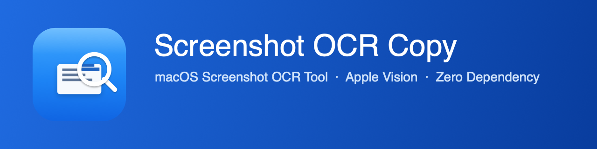

<div align="center">



# スクリーンショット OCR コピー 📸

[简体中文](README.zh.md) | [English](README.md) | **日本語**

macOS メニューバー常駐型の軽量スクリーンショット OCR ツール。画面の任意の領域を選択し、中国語/英語テキストを自動認識してクリップボードにコピーします。

完全ネイティブ実装、サードパーティ依存ゼロ、Apple Vision + ScreenCaptureKit ベース。

</div>

## ✨ 機能

- **ワンショット認識** — グローバルホットキー（デフォルト `⌃⌘O`）で領域選択、離すと認識
- **中国語/英語 OCR** — Vision フレームワーク、高精度モード、簡繁中国語と英語の混在に対応
- **スマートレイアウト** — 段落区切りと折り返しを自動判別、元の構造を保持
- **リアルタイムプレビュー** — 選択ドラッグ中に認識結果を表示
- **自動コピー** — 認識完了と同時にクリップボードへ書き込み
- **履歴** — 独立パネル検索、任意の入力方法対応、日付別グループ化（今日 / 昨日 / 今週 / 今月 / それ以前）
- **リキッドグラス通知** — macOS 26 ネイティブ `glassEffect`、スライドイン/アウト + SF Symbols アイコン
- **効果音** — 成功は Hero / 失敗は Basso
- **ログイン時起動** — バックグラウンド自動起動（オプション）
- **カスタマイズ** — ホットキー録音、通知/トースト切り替え、選択枠線幅

## 📋 動作環境

- macOS 26.0 以降（リキッドグラス通知に必要）
- Apple Silicon（arm64）

## 🚀 インストール

### 方法 1：ソースからビルド（推奨）

```bash
git clone https://github.com/nadonghuang/screenshot-ocr-copy.git
cd screenshot-ocr-copy
./build.sh
```

`build.sh` がコンパイル・パッケージ・署名・`/Applications` へのインストールを自動実行し、アプリを起動します。

### 初回起動の権限付与

起動後、**システム設定 → プライバシーとセキュリティ** で以下の権限を付与してください：

| 権限 | 用途 | 必須 |
| --- | --- | --- |
| 画面収録 | 画面領域のキャプチャ | ✅ 必須 |
| 入力監視 | グローバルホットキー監視 | ✅ 必須 |
| アクセシビリティ | 操作の最適化 | ⭕ 任意 |
| 通知 | OCR 結果通知 | ⭕ 任意 |

権限付与後、アプリを再起動してください。

## ⌨️ 使い方

1. ホットキー `⌃⌘O` を押す（またはメニューバーアイコンをクリック）
2. 認識したい領域をドラッグで選択
3. マウスを離し、少し待つ
4. 認識結果がクリップボードにコピーされます 🔔

**メニューバー機能**：

- スクリーンショット OCR 開始
- 履歴…（検索パネル）
- ログイン時に起動 トグル
- 設定（ホットキー、トースト/通知、選択枠線幅）
- 終了

## ⚙️ 設定

メニューバーの **設定** をクリックしてカスタマイズ：

- **ホットキー** — 「録音」をクリック後、新しいキー组合せを押す
- **トースト** — 成功時にリキッドグラス通知 + 効果音
- **通知** — 認識結果の要約を表示
- **選択枠線幅** — 選択枠の太さを調整

## 🛠 技術スタック

| 能力 | フレームワーク |
| --- | --- |
| UI / メニューバー | Cocoa (AppKit) |
| リキッドグラス通知 | SwiftUI `glassEffect` |
| スクリーンショット | ScreenCaptureKit |
| 文字認識 | Vision |
| グローバルホットキー | Carbon + CGEventTap |
| ログイン時起動 | ServiceManagement |
| 通知 | UserNotifications |

### ホットキーの三重保障

グローバルホットキーがあらゆる場面で確実に発動するよう、3 層構造を採用：

1. **Carbon `RegisterEventHotKey`** — 標準グローバルホットキー
2. **CGEventTap** — システムレベルのキーイベント傍受フォールバック
3. **Darwin Notification** — プロセス間トリガーフォールバック

### OCR テキストレイアウトアルゴリズム

Vision が返す各テキストブロックの bounding box に基づき、Y 座標で行にクラスタリング、行間隔とインデントのヒューリスティックで判定：

- 行間隔 > 1.8× 行高 → 段落区切り（改行を保持）
- 行頭が左端 + 前行が短い → 実改行
- 行頭がインデント → 折り返し（自動結合）

## 📂 プロジェクト構造

```
src/
├── main.swift        # 全ソースコード
└── Info.plist        # バンドル & 権限設定
build.sh              # ビルドスクリプト
```

## 📄 ライセンス

MIT
