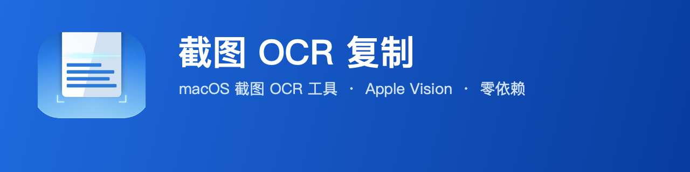

<div align="center">



# 截图OCR复制 📸

<a href="https://github.com/nadonghuang/screenshot-ocr-copy/releases/latest"></a>      

[简体中文](README.zh.md) | [English](README.md) | [日本語](README.ja.md)

**一个快捷键，屏幕上的文字秒进剪贴板。** 轻量级、**完全离线** 的 macOS 菜单栏 **文字识别** 工具——截图 → **Apple Vision OCR** → 复制。**免费开源、无需 API Key、不上云、零第三方依赖。** 可视为 **Snipaste 的 OCR 原生替代方案**。

基于 Apple Vision + ScreenCaptureKit + AppKit，纯 Swift 单文件实现。

</div>

## ✨ 功能特性

- **一键截图识别** — 全局快捷键（默认 `⌃⌘O`）框选区域，松开即识别
- **中英文 OCR** — 基于 Vision 框架，准确模式，支持简繁中文与英文混排
- **智能排版** — 自动区分段落换行与软换行，保留原文结构
- **实时预览** — 拖动选区时即可看到识别结果
- **自动复制** — 识别完成自动写入剪贴板
- **历史记录** — 独立面板搜索，支持任意输入法，按时间分级（今天 / 昨天 / 本周 / 本月 / 更早）
- **液态玻璃弹窗** — macOS 26 原生 `glassEffect`，滑动入出动画 + SF Symbols 图标
- **音效反馈** — 成功 Hero / 失败 Basso
- **开机自启** — 可选开机自动后台运行
- **可自定义** — 快捷键实时录制、弹窗 / 通知开关、选框线宽

## 📋 系统要求

- macOS 26.0 或更高（液态玻璃弹窗需要）
- Apple Silicon（arm64）

## 🚀 安装

### 方式一：源码构建（推荐）

```bash
git clone https://github.com/nadonghuang/screenshot-ocr-copy.git
cd screenshot-ocr-copy
./build.sh
```

`build.sh` 会自动编译、打包、签名并安装到 `/Applications`，然后启动应用。

### 首次运行授权

应用启动后，需在「系统设置 → 隐私与安全性」中授予以下权限：

| 权限 | 用途 | 是否必需 |
| --- | --- | --- |
| 屏幕录制 | 截取屏幕区域 | ✅ 必需 |
| 输入监控 | 全局快捷键监听 | ✅ 必需 |
| 辅助功能 | 部分交互优化 | ⭕ 可选 |
| 通知 | OCR 结果提醒 | ⭕ 可选 |

授权后重启应用即可正常使用。

## ⌨️ 使用方法

1. 按下快捷键 `⌃⌘O`（或点击菜单栏图标）
2. 在屏幕上拖动框选要识别的区域
3. 松开鼠标，稍等片刻
4. 识别结果已自动复制到剪贴板 🔔

**菜单栏功能**：

- 开始截图 OCR
- 历史记录…（搜索面板）
- 开机自启动开关
- 设置（自定义快捷键、弹窗 / 通知、选框线宽）
- 退出

## ⚙️ 设置

在菜单栏点击「设置」可自定义：

- **快捷键** — 点击「录制」后按下新的快捷键组合
- **弹窗提示** — 成功时显示液态玻璃弹窗 + 音效
- **通知提醒** — 显示识别结果摘要
- **选框线宽** — 调整选区边框粗细

## 🛠 技术栈

| 能力 | 框架 |
| --- | --- |
| UI / 菜单栏 | Cocoa (AppKit) |
| 液态玻璃弹窗 | SwiftUI `glassEffect` |
| 屏幕截图 | ScreenCaptureKit |
| 文字识别 | Vision |
| 全局快捷键 | Carbon + CGEventTap |
| 开机自启 | ServiceManagement |
| 通知 | UserNotifications |

### 快捷键三重保障

为保证全局快捷键在各种场景下稳定触发，采用三层机制：

1. **Carbon `RegisterEventHotKey`** — 标准全局热键
2. **CGEventTap** — 系统级键盘事件拦截兜底
3. **Darwin Notification** — 跨进程触发兜底

### OCR 文本排版算法

基于 Vision 返回的每个文本块的 bounding box，按 Y 坐标聚类成行，
再依据行间距与缩进启发式判断：

- 行间距 > 1.8 倍行高 → 段落断行（保留换行）
- 行首贴左边界 + 上一行较短 → 真换行
- 行首缩进 → 软换行（自动拼接）

## 📂 项目结构

```
src/
├── main.swift        # 全部源码
└── Info.plist        # Bundle 与权限配置
build.sh              # 构建脚本
```

## 📄 许可证

MIT
